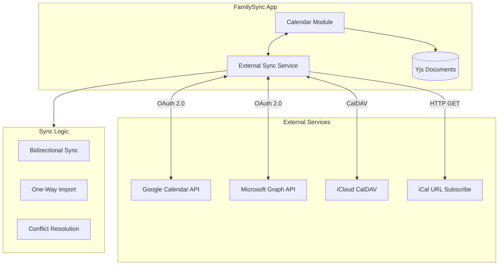

# FamilySync Complete App Functionalities Plan

This plan extends the existing architecture in [docs/ARCHITECTURE.md](docs/ARCHITECTURE.md) and [docs/DATA-MODEL.md](docs/DATA-MODEL.md) with comprehensive feature specifications for all modules.

---

## Module Feature Specifications

### 1. Calendar Module - Full Feature Set

#### Core Calendar Features

| Feature | Description | Priority |

|---------|-------------|----------|

| Multiple Views | Day, Week, Month, Agenda, Year views with smooth transitions | High |

| Recurring Events | Daily, weekly, monthly, yearly with complex patterns (RFC 5545) | High |

| All-Day Events | Multi-day spanning events with visual indicators | High |

| Event Reminders | Multiple reminders per event (notification, email) | High |

| Time Zone Support | Display events in local/event timezone with conversion | High |

| Calendar Sharing | Share with family members with granular permissions | High |

| Color Coding | Per-calendar and per-event colors | Medium |

| Event Categories | Custom categories with icons (Birthday, Appointment, etc.) | Medium |

#### Advanced Calendar Features

| Feature | Description | Priority |

|---------|-------------|----------|

| Smart Scheduling | Find optimal meeting times based on family availability | High |

| Natural Language Input | "Dentist appointment tomorrow at 3pm" parsing | High |

| Event Templates | Pre-defined templates for common events | Medium |

| Drag-and-Drop | Reschedule events by dragging in calendar view | High |

| Quick Add | Keyboard shortcut to quickly create events | Medium |

| Event Duplication | Clone events with date modification | Medium |

| Conflict Detection | Warn when scheduling overlapping events | Medium |

| RSVP System | Attendee responses (Accept/Decline/Maybe) | Medium |

#### Integration Features

| Feature | Description | Priority |

|---------|-------------|----------|

| iCal Import/Export | Full RFC 5545 compliance | High |

| External Calendar Sync | Google Calendar, Outlook, iCloud (optional) | High |

| Task Integration | Link tasks to calendar events, show tasks on calendar | High |

| Email Integration | Create events from emails | Medium |

| Birthday Calendar | Auto-generate from family member profiles | Low |

#### Calendar UI Components

```
modules/calendar/
├── components/
│   ├── views/
│   │   ├── MonthView.tsx
│   │   ├── WeekView.tsx
│   │   ├── DayView.tsx
│   │   ├── AgendaView.tsx
│   │   └── YearView.tsx
│   ├── EventEditor.tsx
│   ├── RecurrenceEditor.tsx
│   ├── SmartScheduler.tsx
│   ├── NaturalLanguageInput.tsx
│   ├── EventTemplateSelector.tsx
│   └── CalendarSyncSettings.tsx
```

---

### 2. Tasks Module - Full Feature Set

#### Core Task Features

| Feature | Description | Priority |

|---------|-------------|----------|

| Task Lists | Multiple lists with custom colors and icons | High |

| Subtasks | Nested tasks with progress tracking | High |

| Due Dates/Times | With optional time component | High |

| Priority Levels | None, Low, Medium, High, Urgent | High |

| Task Assignment | Assign to one or multiple family members | High |

| Labels/Tags | Custom colored labels for organization | High |

| Task Status | Todo, In Progress, Blocked, Done, Cancelled | High |

| Recurring Tasks | Daily, weekly, monthly recurring tasks | High |

#### Advanced Task Features

| Feature | Description | Priority |

|---------|-------------|----------|

| Kanban Board View | Drag-drop columns for workflow management | High |

| Natural Language Input | "Buy milk tomorrow high priority" | High |

| Task Templates | Pre-defined task templates | Medium |

| Checklist Items | Quick checkboxes within tasks | High |

| Task Dependencies | Block tasks until prerequisites complete | Medium |

| Time Tracking | Estimated vs actual time spent | Low |

| Batch Operations | Multi-select for bulk actions | Medium |

| Quick Add | Keyboard shortcut for rapid task entry | Medium |

#### Task Views

| View | Description | Priority |

|------|-------------|----------|

| List View | Traditional list with sorting/filtering | High |

| Board View | Kanban-style columns | High |

| Calendar View | Tasks on calendar by due date | Medium |

| Timeline View | Gantt-style visualization | Low |

| My Tasks | Personal tasks across all lists | High |

#### Task Filters and Search

| Filter | Description |

|--------|-------------|

| By Assignee | Filter by family member |

| By Due Date | Today, Tomorrow, This Week, Overdue, No Date |

| By Priority | Filter by priority level |

| By Status | Filter by task status |

| By Label | Filter by one or more labels |

| Full-Text Search | Search in title and description |

---

### 3. Email Module - Full Feature Set

#### External Email (IMAP/SMTP)

| Feature | Description | Priority |

|---------|-------------|----------|

| Multi-Account Support | Connect Gmail, Outlook, Yahoo, custom IMAP | High |

| Threaded Conversations | Group related emails into threads | High |

| Folder Management | IMAP folders with sync | High |

| Labels/Tags | Custom labels for organization | High |

| Rich Text Composer | Full HTML editor with formatting | High |

| Attachments | Send/receive with preview | High |

| Email Search | Full-text search with filters | High |

| Signatures | Per-account signatures | Medium |

#### Advanced Email Features

| Feature | Description | Priority |

|---------|-------------|----------|

| Email Snooze | Remind about email later | Medium |

| Scheduled Send | Send emails at specific time | Medium |

| Email Templates | Reusable email templates | Medium |

| Quick Reply | Inline reply without full composer | Medium |

| Undo Send | Cancel sent email within grace period | Medium |

| Read Receipts | Request read confirmation (optional) | Low |

| Smart Sorting | Priority inbox based on sender/content | Low |

#### Shared Email Features

| Feature | Description | Priority |

|---------|-------------|----------|

| Shared Inbox | Multiple members access same account | High |

| Send-As Permission | Send on behalf of shared account | High |

| Email Assignment | Assign emails to family members | Medium |

| Internal Notes | Add notes to emails (not sent) | Low |

#### Internal Family Messaging

| Feature | Description | Priority |

|---------|-------------|----------|

| Direct Messages | 1:1 conversations | High |

| Group Chats | Multi-member conversations | High |

| Message Reactions | Emoji reactions | Medium |

| Reply Threading | Reply to specific messages | Medium |

| File Sharing | Share files within conversations | High |

| Message Search | Search conversation history | Medium |

| Read Receipts | See who read messages | Medium |

| Typing Indicators | Real-time typing status | Low |

---

### 4. Family-Specific Features (NEW MODULES)

#### 4.1 Chore Management Module

```typescript
// New: modules/chores/types/Chore.types.ts
interface Chore extends BaseEntity {
  familyId: string;
  title: string;
  description?: string;
  icon?: string;
  
  // Assignment
  assignees: ChoreAssignment[];
  rotationEnabled: boolean;
  rotationSchedule?: RotationSchedule;
  
  // Scheduling
  frequency: ChoreFrequency;
  preferredTime?: string; // "morning" | "afternoon" | "evening"
  estimatedDuration: number; // minutes
  
  // Rewards
  pointValue: number;
  bonusPoints?: number; // for early completion
  
  // Verification
  requiresVerification: boolean;
  verifierId?: string; // parent who must approve
  requiresPhoto: boolean;
}

interface ChoreAssignment {
  memberId: string;
  startDate: string;
  endDate?: string;
  status: 'pending' | 'in_progress' | 'completed' | 'verified' | 'skipped';
  completedAt?: string;
  verifiedAt?: string;
  photoProof?: string;
}

interface RotationSchedule {
  type: 'daily' | 'weekly' | 'custom';
  memberOrder: string[];
  currentIndex: number;
}

type ChoreFrequency = 
  | { type: 'daily' }
  | { type: 'weekly'; daysOfWeek: number[] }
  | { type: 'monthly'; dayOfMonth: number }
  | { type: 'custom'; rrule: string };
```

**Chore Features:**

| Feature | Description |

|---------|-------------|

| Chore Templates | Pre-defined common household chores |

| Auto-Rotation | Automatically rotate assignees |

| Age-Appropriate | Suggest chores based on member age |

| Photo Verification | Require photo proof for completion |

| Parent Approval | Require parent to verify completion |

| Chore Charts | Visual weekly/monthly chore charts |

| Streak Tracking | Track consecutive completions |

#### 4.2 Rewards/Points System Module

```typescript
// New: modules/rewards/types/Rewards.types.ts
interface RewardsAccount extends BaseEntity {
  memberId: string;
  familyId: string;
  totalPoints: number;
  availablePoints: number;
  lifetimePoints: number;
  level: number;
  streak: number;
  longestStreak: number;
}

interface PointTransaction extends BaseEntity {
  accountId: string;
  type: 'earned' | 'spent' | 'bonus' | 'penalty' | 'gift';
  amount: number;
  balance: number;
  source: {
    type: 'chore' | 'task' | 'achievement' | 'reward' | 'manual';
    referenceId?: string;
    description: string;
  };
}

interface Reward extends BaseEntity {
  familyId: string;
  title: string;
  description?: string;
  icon?: string;
  pointCost: number;
  category: 'screen_time' | 'treats' | 'activities' | 'money' | 'custom';
  
  // Availability
  availableToRoles: MemberRole[];
  quantity?: number; // unlimited if not set
  cooldownDays?: number; // days between redemptions
  
  // Approval
  requiresApproval: boolean;
  approverId?: string;
}

interface Achievement extends BaseEntity {
  familyId: string;
  title: string;
  description: string;
  icon: string;
  pointReward: number;
  criteria: AchievementCriteria;
  secret: boolean; // hidden until earned
}
```

**Rewards Features:**

| Feature | Description |

|---------|-------------|

| Points Dashboard | Visual points balance and history |

| Reward Store | Browse and redeem rewards |

| Achievements | Unlock badges for accomplishments |

| Leaderboard | Family rankings (optional) |

| Level System | Progress through levels |

| Gift Points | Transfer points between members |

| Point History | Complete transaction log |

#### 4.3 Shopping Lists Module

```typescript
// New: modules/shopping/types/Shopping.types.ts
interface ShoppingList extends BaseEntity {
  familyId: string;
  name: string;
  icon?: string;
  color?: string;
  store?: string;
  
  // Settings
  autoSort: boolean;
  sortByCategory: boolean;
  showPrices: boolean;
  
  // Sharing
  sharedWithMembers: string[];
  defaultPermission: 'view' | 'edit';
}

interface ShoppingItem extends BaseEntity {
  listId: string;
  name: string;
  quantity: number;
  unit?: string;
  category?: string;
  
  // Optional details
  brand?: string;
  notes?: string;
  estimatedPrice?: number;
  actualPrice?: number;
  
  // Status
  checked: boolean;
  checkedBy?: string;
  checkedAt?: string;
  addedBy: string;
  
  // Recurrence
  recurring: boolean;
  autoAdd?: {
    frequency: 'weekly' | 'biweekly' | 'monthly';
    dayOfWeek?: number;
  };
}

interface ItemCategory {
  id: string;
  name: string;
  icon: string;
  sortOrder: number;
}
```

**Shopping Features:**

| Feature | Description |

|---------|-------------|

| Multiple Lists | Separate lists for different stores |

| Category Sorting | Auto-sort by aisle/category |

| Quantity & Units | "2 lbs" or "3 cans" |

| Price Tracking | Estimate and actual prices |

| Recurring Items | Auto-add weekly staples |

| Quick Add | Barcode scanning (future mobile) |

| Shared Editing | Real-time collaboration |

| Meal Plan Integration | Auto-populate from recipes |

#### 4.4 Meal Planning Module

```typescript
// New: modules/meals/types/Meals.types.ts
interface Recipe extends BaseEntity {
  familyId: string;
  title: string;
  description?: string;
  image?: string;
  
  // Details
  prepTime: number; // minutes
  cookTime: number;
  servings: number;
  difficulty: 'easy' | 'medium' | 'hard';
  
  // Content
  ingredients: RecipeIngredient[];
  instructions: string[]; // step by step
  notes?: string;
  
  // Categorization
  categories: string[]; // breakfast, dinner, dessert
  cuisines: string[];
  dietaryTags: string[]; // vegetarian, gluten-free
  
  // Ratings
  rating?: number;
  timesCooked: number;
  lastCookedAt?: string;
  
  // Source
  source?: {
    type: 'manual' | 'url' | 'import';
    url?: string;
  };
}

interface RecipeIngredient {
  name: string;
  quantity: number;
  unit: string;
  notes?: string;
  optional: boolean;
  category: string; // for shopping list
}

interface MealPlan extends BaseEntity {
  familyId: string;
  weekStartDate: string; // YYYY-MM-DD
  meals: PlannedMeal[];
}

interface PlannedMeal {
  id: string;
  date: string;
  mealType: 'breakfast' | 'lunch' | 'dinner' | 'snack';
  recipeId?: string;
  customMeal?: string; // if not from recipe
  notes?: string;
  servings: number;
  assignedCook?: string;
}
```

**Meal Planning Features:**

| Feature | Description |

|---------|-------------|

| Recipe Library | Store and organize family recipes |

| Weekly Planner | Plan meals for the week |

| Shopping List Generation | Auto-create shopping list from meal plan |

| Serving Adjustment | Scale recipes for family size |

| Dietary Filters | Filter by dietary restrictions |

| Favorites | Mark frequently used recipes |

| Recipe Import | Import from URLs (future) |

| Meal History | Track what was cooked when |

---

### 5. Dashboard & Widgets Module

```typescript
// New: modules/dashboard/types/Dashboard.types.ts
interface DashboardConfig extends BaseEntity {
  memberId: string;
  familyId: string;
  layout: WidgetLayout[];
}

interface WidgetLayout {
  widgetId: string;
  widgetType: WidgetType;
  position: { x: number; y: number };
  size: { width: number; height: number };
  config: Record<string, unknown>;
}

type WidgetType =
  | 'upcoming_events'
  | 'today_tasks'
  | 'chore_status'
  | 'points_summary'
  | 'shopping_lists'
  | 'meal_plan'
  | 'activity_feed'
  | 'family_calendar'
  | 'quick_actions'
  | 'weather'
  | 'custom_note';
```

**Available Widgets:**

| Widget | Description |

|--------|-------------|

| Upcoming Events | Next 5-7 events across calendars |

| Today's Tasks | Tasks due today with quick complete |

| Chore Status | Today's chores with completion status |

| Points Summary | Current points and recent activity |

| Shopping Quick View | Items needed on active lists |

| This Week's Meals | Meal plan for current week |

| Activity Feed | Recent family activity |

| Quick Actions | Fast access to common actions |

| Family Calendar | Mini calendar with events |

| Weather | Local weather (requires location) |

---

### 6. Smart Notifications System

```typescript
// New: modules/notifications/types/Notifications.types.ts
interface NotificationConfig extends BaseEntity {
  memberId: string;
  familyId: string;
  
  // Quiet Hours
  quietHours: {
    enabled: boolean;
    start: string; // "22:00"
    end: string;   // "07:00"
    allowUrgent: boolean;
  };
  
  // Digest
  dailyDigest: {
    enabled: boolean;
    time: string;
    include: ('events' | 'tasks' | 'chores' | 'messages')[];
  };
  
  // Per-type settings
  eventReminders: NotificationPreference;
  taskReminders: NotificationPreference;
  choreReminders: NotificationPreference;
  messages: NotificationPreference;
  systemAlerts: NotificationPreference;
}

interface NotificationPreference {
  enabled: boolean;
  desktop: boolean;
  sound: boolean;
  priority: 'low' | 'normal' | 'high';
}
```

**Notification Features:**

| Feature | Description |

|---------|-------------|

| Smart Digest | Combined morning/evening summary |

| Quiet Hours | No notifications during set times |

| Priority Override | Urgent notifications bypass quiet hours |

| Per-Type Settings | Configure each notification type |

| Snooze | Temporarily silence notifications |

| Notification Center | View all past notifications |

---

### 7. Activity Feed & Insights

```typescript
// New: modules/activity/types/Activity.types.ts
interface ActivityEntry extends BaseEntity {
  familyId: string;
  actorId: string;
  action: ActivityAction;
  resourceType: string;
  resourceId: string;
  resourceTitle: string;
  metadata?: Record<string, unknown>;
}

type ActivityAction =
  | 'created' | 'updated' | 'deleted'
  | 'completed' | 'assigned' | 'unassigned'
  | 'shared' | 'commented'
  | 'earned_points' | 'redeemed_reward'
  | 'joined' | 'left';

interface FamilyInsights {
  period: 'week' | 'month' | 'year';
  
  tasks: {
    completed: number;
    overdue: number;
    completionRate: number;
    byMember: Record<string, number>;
  };
  
  chores: {
    completed: number;
    skipped: number;
    completionRate: number;
    byMember: Record<string, number>;
    streaks: Record<string, number>;
  };
  
  events: {
    total: number;
    attended: number;
    byCalendar: Record<string, number>;
  };
  
  points: {
    earned: number;
    spent: number;
    topEarner: string;
  };
}
```

**Activity & Insights Features:**

| Feature | Description |

|---------|-------------|

| Activity Timeline | Chronological family activity |

| Filter by Member | View specific member's activity |

| Filter by Type | Filter by action type |

| Weekly Summary | Automated weekly statistics |

| Monthly Report | Detailed monthly insights |

| Charts & Graphs | Visual data representation |

| Export Data | Export activity history |

---

### 8. External Calendar Sync Architecture



**External Sync Features:**

| Feature | Description |

|---------|-------------|

| Google Calendar | Full bidirectional sync via API |

| Outlook/Microsoft 365 | Full bidirectional sync via Graph API |

| iCloud Calendar | CalDAV-based sync |

| iCal Subscriptions | Read-only URL subscriptions |

| Selective Sync | Choose which external calendars to sync |

| Conflict Resolution | Handle edit conflicts gracefully |

| Offline Queue | Queue changes when offline |

---

## Updated Module Structure

```
src/modules/
├── family/           # Existing - enhanced
├── calendar/         # Existing - enhanced with smart features
├── tasks/            # Existing - enhanced with Kanban, NLP
├── email/            # Existing - enhanced with snooze, templates
├── chores/           # NEW - chore management
├── rewards/          # NEW - points and gamification
├── shopping/         # NEW - shopping lists
├── meals/            # NEW - meal planning
├── dashboard/        # NEW - widgets and home screen
├── notifications/    # NEW - smart notification system
├── activity/         # NEW - activity feed and insights
└── settings/         # NEW - app-wide settings
```

---

## Data Model Extensions Summary

| Module | New Entities |

|--------|--------------|

| Chores | Chore, ChoreAssignment, ChoreTemplate, RotationSchedule |

| Rewards | RewardsAccount, PointTransaction, Reward, Achievement, RewardRedemption |

| Shopping | ShoppingList, ShoppingItem, ItemCategory, FavoriteItem |

| Meals | Recipe, RecipeIngredient, MealPlan, PlannedMeal |

| Dashboard | DashboardConfig, WidgetLayout |

| Notifications | NotificationConfig, NotificationEntry |

| Activity | ActivityEntry, FamilyInsights |

---

## Implementation Priority

### Phase 1: Core Enhancement (Weeks 1-4)

- Enhanced Calendar with all views and recurring events
- Enhanced Tasks with Kanban and subtasks
- Basic Email with threading and folders

### Phase 2: Family Features (Weeks 5-8)

- Chore Management with rotation
- Rewards/Points System
- Shopping Lists

### Phase 3: Advanced Features (Weeks 9-12)

- Natural Language Processing
- Smart Scheduling
- Meal Planning
- Dashboard & Widgets

### Phase 4: Integration & Polish (Weeks 13-16)

- External Calendar Sync (Google, Outlook, iCloud)
- Smart Notifications
- Activity Feed & Insights
- Data Export/Import

### Phase 5: Mobile Preparation (Weeks 17-20)

- Abstract platform-specific code
- Prepare React Native/Capacitor migration path
- Optimize for touch interfaces

---

## Files to Update

1. **[docs/ARCHITECTURE.md](docs/ARCHITECTURE.md)** - Add new module architecture
2. **[docs/DATA-MODEL.md](docs/DATA-MODEL.md)** - Add new entity definitions
3. **Create [docs/FEATURES.md](docs/FEATURES.md)** - Detailed feature specifications
4. **Create [docs/API-CONTRACTS.md](docs/API-CONTRACTS.md)** - IPC channel definitions
5. **Update [.cursor/plans/familysync_architecture_plan_d7b5aa1c.plan.md](.cursor/plans/familysync_architecture_plan_d7b5aa1c.plan.md)** - Add new todos