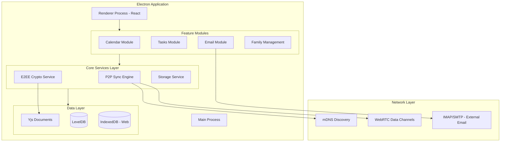
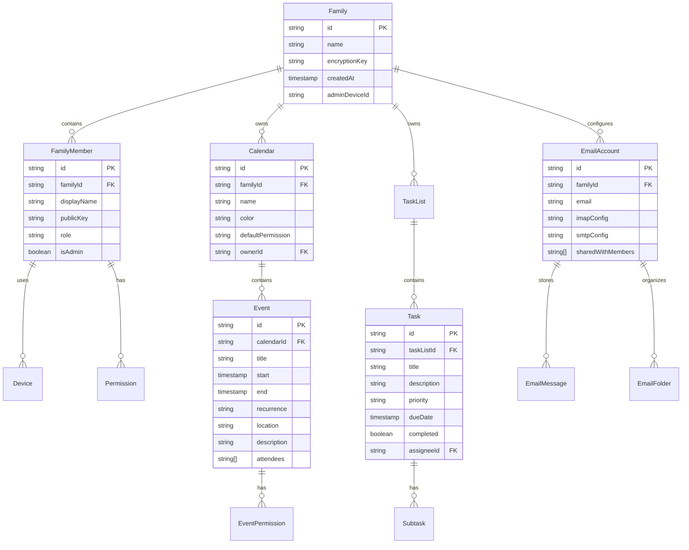
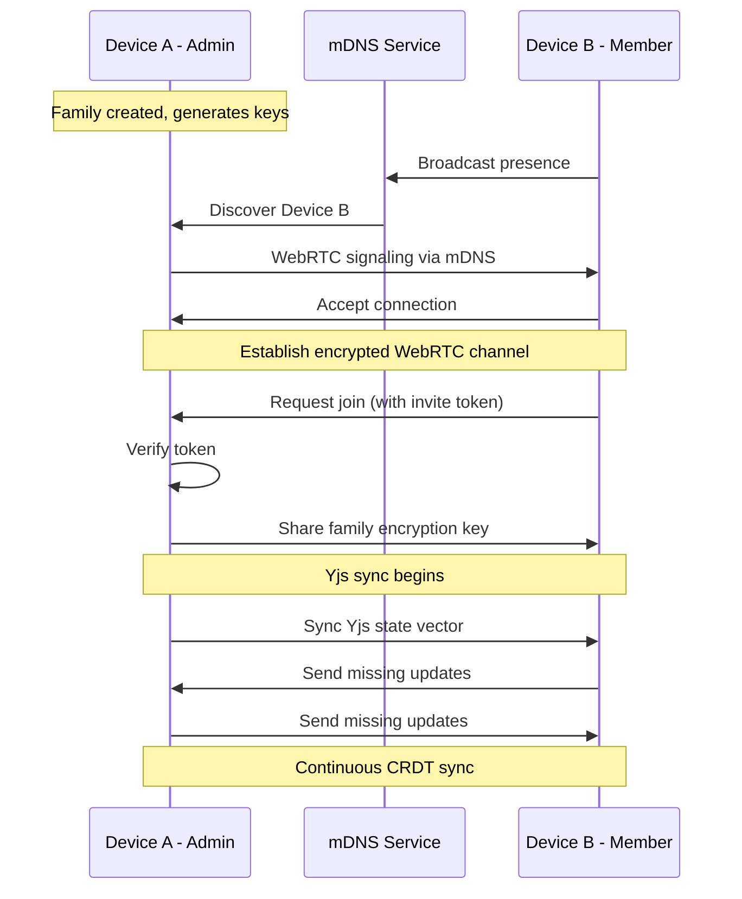

# FamilySync - Architecture & Documentation Plan

## Project Summary

FamilySync is an offline-first, end-to-end encrypted Electron application for family collaboration. It features P2P synchronization via mDNS discovery, CRDT-based conflict resolution, and comprehensive Calendar, Tasks, and Email management.

---

## Architecture Overview



---

## Tech Stack Decisions

### Core Framework

| Technology | Purpose | Rationale |

|------------|---------|-----------|

| Electron 33+ | Desktop runtime | Cross-platform, future Capacitor compatibility |

| React 19 | UI framework | Component model, ecosystem, mobile portability |

| TypeScript 5.5+ | Type safety | Better DX, refactoring support |

| Vite | Build tool | Fast HMR, ESM-first, Electron plugin available |

### Data & Sync

| Technology | Purpose | Rationale |

|------------|---------|-----------|

| Yjs | CRDT implementation | Best-in-class CRDT, automatic conflict resolution |

| y-leveldb | Persistence provider | Fast, embeddable, works with Electron |

| y-webrtc | P2P transport | Works with mDNS signaling |

| libp2p | P2P networking | mDNS discovery, NAT traversal |

### Security

| Technology | Purpose | Rationale |

|------------|---------|-----------|

| libsodium-wrappers | Encryption primitives | Industry standard, fast, audited |

| @noble/ed25519 | Key derivation | Modern, audited cryptography |

| electron-store | Secure storage | Encrypted config storage |

### UI/UX

| Technology | Purpose | Rationale |

|------------|---------|-----------|

| shadcn/ui | Component library | Customizable, accessible, Tailwind-based |

| Tailwind CSS 4 | Styling | Utility-first, consistent design |

| Framer Motion | Animations | Declarative, performant |

| Radix UI | Primitives | Accessible, unstyled components |

| Lucide React | Icons | Clean, consistent icon set |

### Feature-Specific

| Technology | Purpose | Rationale |

|------------|---------|-----------|

| ical.js | iCal parsing/generation | RFC 5545 compliant |

| date-fns | Date manipulation | Lightweight, tree-shakeable |

| @electron/ipcMain | Email protocols | Full IMAP/SMTP support |

| imapflow | IMAP client | Modern, promise-based |

| nodemailer | SMTP client | Battle-tested |

### Development

| Technology | Purpose |

|------------|---------|

| ESLint 9 (flat config) | Linting |

| Prettier | Formatting |

| Husky + lint-staged | Git hooks |

| Vitest | Unit/Integration tests |

| React Testing Library | Component tests |

| Playwright | E2E tests |

---

## Data Model Architecture



---

## P2P Sync Architecture



---

## Folder Structure

```
FamilySync/
├── .husky/                     # Git hooks
├── .vscode/                    # VS Code settings
├── docs/                       # Project documentation
│   ├── ARCHITECTURE.md
│   ├── CONTRIBUTING.md
│   ├── SECURITY.md
│   └── API.md
├── electron/                   # Electron main process
│   ├── main.ts
│   ├── preload.ts
│   └── services/
│       ├── crypto.service.ts
│       ├── storage.service.ts
│       ├── sync.service.ts
│       └── email.service.ts
├── src/                        # React renderer
│   ├── app/                    # App shell
│   │   ├── App.tsx
│   │   ├── Router.tsx
│   │   └── providers/
│   ├── modules/                # Feature modules
│   │   ├── family/
│   │   │   ├── components/
│   │   │   ├── hooks/
│   │   │   ├── stores/
│   │   │   └── types/
│   │   ├── calendar/
│   │   │   ├── components/
│   │   │   ├── hooks/
│   │   │   ├── stores/
│   │   │   ├── utils/
│   │   │   └── types/
│   │   ├── tasks/
│   │   │   ├── components/
│   │   │   ├── hooks/
│   │   │   ├── stores/
│   │   │   └── types/
│   │   └── email/
│   │       ├── components/
│   │       ├── hooks/
│   │       ├── stores/
│   │       └── types/
│   ├── shared/                 # Shared code
│   │   ├── components/         # UI components
│   │   ├── hooks/              # Shared hooks
│   │   ├── lib/                # Utilities
│   │   ├── stores/             # Global stores
│   │   └── types/              # Shared types
│   ├── styles/                 # Global styles
│   └── index.tsx
├── tests/                      # Test files
│   ├── unit/
│   ├── integration/
│   └── e2e/
├── scripts/                    # Build scripts
├── .cursorrules                # Cursor AI rules
├── .eslintrc.cjs
├── .prettierrc
├── electron-builder.json
├── package.json
├── tailwind.config.ts
├── tsconfig.json
├── vite.config.ts
└── vitest.config.ts
```

---

## Code Guidelines Summary

### TypeScript Standards

- Strict mode enabled, no `any` types
- Interface over type for objects
- Explicit return types for public functions
- Barrel exports per module

### React Patterns

- Functional components only
- Custom hooks for business logic
- Zustand for state management (integrates well with Yjs)
- React Query for async state (email fetching)

### Naming Conventions

- Components: `PascalCase.tsx`
- Hooks: `useCamelCase.ts`
- Utils: `camelCase.ts`
- Types: `PascalCase.types.ts`
- Stores: `camelCase.store.ts`

### Import Order

1. React/external libraries
2. Internal modules (absolute paths)
3. Relative imports
4. Styles

---

## Development Phases (Vertical Slices)

### Phase 1: Foundation (Weeks 1-2)

- Project scaffolding with Vite + Electron
- Base UI with shadcn/ui + Tailwind
- Yjs + LevelDB integration
- Basic encryption service setup

### Phase 2: Family Module (Weeks 3-4)

- Family creation flow
- QR code invitation system
- Device management
- Permission system foundation

### Phase 3: Calendar Module (Weeks 5-7)

- Calendar CRUD operations
- Event management with recurrence
- iCal import/export
- Calendar sharing with permissions

### Phase 4: Tasks Module (Weeks 8-9)

- Task list management
- Task CRUD with subtasks
- JSON import/export
- Assignment and due dates

### Phase 5: Email Module (Weeks 10-13)

- IMAP/SMTP integration
- Internal messaging system
- Shared inbox functionality
- Send-as permissions

### Phase 6: P2P Sync (Weeks 14-16)

- mDNS discovery implementation
- WebRTC data channels
- Yjs sync protocol
- Conflict visualization (if needed)

### Phase 7: Polish & Testing (Weeks 17-18)

- Comprehensive E2E tests
- Performance optimization
- Security audit
- Documentation finalization

---

## Documentation Files to Create

1. **[.cursorrules](.cursorrules)** - AI coding guidelines
2. **[docs/ARCHITECTURE.md](docs/ARCHITECTURE.md)** - Detailed system architecture
3. **[docs/CONTRIBUTING.md](docs/CONTRIBUTING.md)** - Contribution guidelines
4. **[docs/SECURITY.md](docs/SECURITY.md)** - Security model documentation
5. **[docs/DATA-MODEL.md](docs/DATA-MODEL.md)** - Complete data schema
6. **[docs/SYNC-PROTOCOL.md](docs/SYNC-PROTOCOL.md)** - P2P sync documentation
7. **[README.md](README.md)** - Project overview and setup

---

## Next Steps

Upon approval, I will create all documentation files with detailed specifications including:

- Complete `.cursorrules` with project-specific guidelines
- Full architecture documentation with sequence diagrams
- Data model specifications with TypeScript interfaces
- Security model with encryption flow diagrams
- API contracts for IPC communication
- Testing strategy documentation